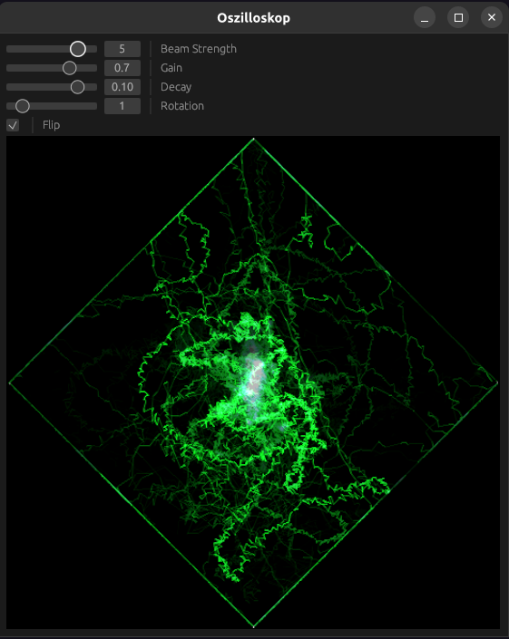

# Oszilloskop

A software XY oscilloscope written in pure Rust, intended as an audio visualizer.

Oszilloskop simulates an electron beam against a phosphor screen which is deflected over time by the two channels of a stereo audio signal in orthogonal directions.

## Screenshot

## Controls

-   **Beam Strength** : how intensely the beam departs energy onto the screen per unit time
-   **Gain** : how much to amplify the input signal, e.g. how much to scale it about the center of the screen
-   **Decay** : how rapidly images on the screen fade
-   **Rotation** : how much to turn the image, in multiples of 45 degrees
-   **Flip** : whether to swap x and y

## Remarks

-   The line drawing algorithm may be especially slow in debug builds, I recommend compiling with `--release` at all times.
-   The current defaults are chosen to create a vertical line for a mono signal, with the individual channels staggered diagonally. I find this aesthetically pleasing and spatially intuitive when listening, but it's not what other oscilloscopes do. The orientation can be adjusted with the rotation and flip controls.
-   Currently, the input audio device can't be chosen through the UI. I use PulseAudio to swap devices, other audio backends provide similar connectivity options but it would be nice to be able to choose from the UI.
-   A large square/diamond outline is most likely due to clipping
-   A perfectly straight line means you have a mono or single-channel signal. Only stereo signals with significant differences between the left and right channels will do anything interesting.
-   Oscilloscope music such as that by [Jerobeam Fenderson](https://jerobeamfenderson.bandcamp.com/album/oscilloscope-music) is best played uncompressed and purely digitally. Compression (such as via online streaming services) and analog effects from traveling over a speaker cable may induce visible rounding, shifting, and general distortion. You may also need to choose rotation=0 and flip=no for the correct viewing orientation.
